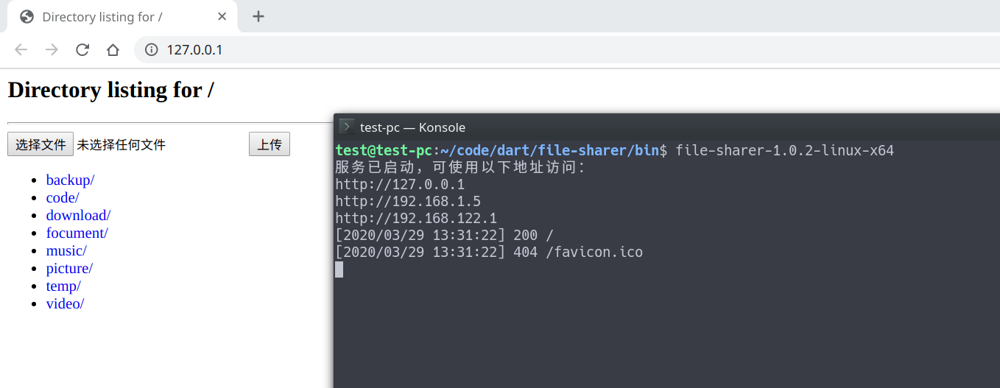

# file-sharer
基于 HTTP 协议的局域网文件共享，支持 Windows、Linux 和 MacOS，支持断点续传。

# 使用
使用默认端口 80，共享用户家目录，仅显示非隐藏文件：
```bash
file-sharer
```
使用默认端口 80，共享根目录，仅显示非隐藏文件：
```bash
file-sharer /
```
使用端口 8000，共享当前目录，显示所有文件：
```bash
file-sharer -p 8000 -a .
```
查看帮助信息：
```bash
file-sharer -h
```
在终端里按下 Ctrl + C 即可停止共享。

# Windows
`-a` 选项暂时不可用，也就是说无论如何，你的共享目录中的隐藏文件都会被显示出来。

# Linux
默认情况下，普通用户无法绑定标准端口，可使用如下命令添加权限：
```bash
# {filename} 为你的可执行文件的路径
sudo setcap cap_net_bind_service=+eip {filename}
```
不建议使用 root 权限运行本程序，除非你知道自己在做什么。

# MacOS
理论上支持 MacOS，但是我没有 MacOS 设备，无法测试兼容性，如果你遇到了问题，欢迎反馈。

# 截图

